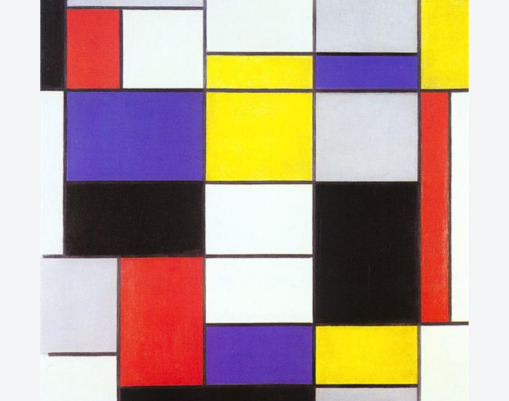
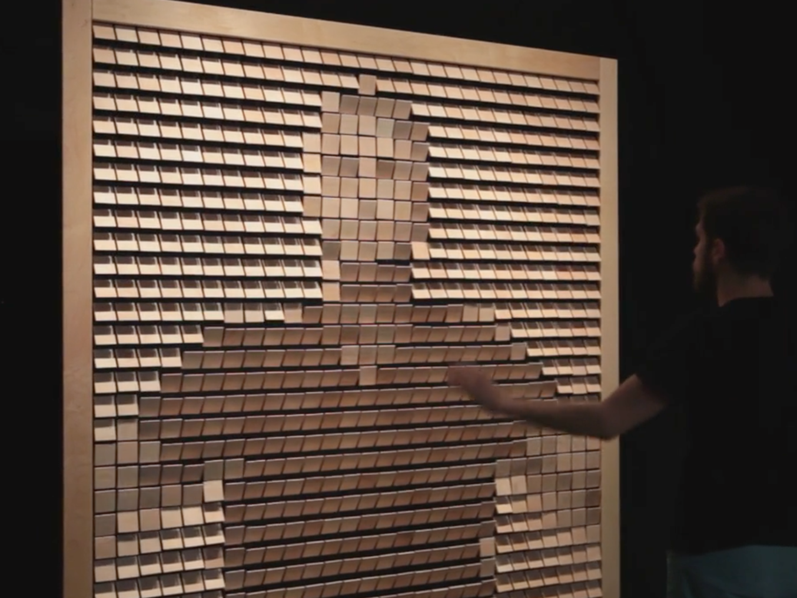

<!-- ---  
title: Theoretical Backgrounds of Audio and Graphics
author: Angela Brennecke
affiliation: Film University Babelsberg KONRAD WOLF
date: Winter term 20/21
---   -->
**Theoretical Backgrounds of Audio and Graphics - Winter term 21/22**

Prof. Dr.-Ing. Angela Brennecke | a.brennecke@filmuniversitaet.de | Film University Babelsberg *KONRAD WOLF*

---

- [Graphics Rendering - Learning Objectives](#graphics-rendering---learning-objectives)
- [Graphics Rendering Basics](#graphics-rendering-basics)
  - [Additional Material](#additional-material)
- [Processing introduction](#processing-introduction)
  - [Exercises](#exercises)
    - [Exercise 1](#exercise-1)
    - [Exercise 2](#exercise-2)
- [Euclidian Geometry and Vertices](#euclidian-geometry-and-vertices)
  - [Lecture Video](#lecture-video)
  - [Additional Material](#additional-material-1)
- [Homework Assignments](#homework-assignments)
  - [Computer Graphics History](#computer-graphics-history)
    - [Lecture Video](#lecture-video-1)
  - [Research Tasks](#research-tasks)
    - [Group 1 -- Lights](#group-1----lights)
    - [Group 2 -- Transformations](#group-2----transformations)
    - [Group 3 -- Meshes](#group-3----meshes)
  - [Practical Exercises - Extra](#practical-exercises---extra)
      - [Exercise 1](#exercise-1-1)
      - [Exercise 2](#exercise-2-1)
      - [Exercise 3](#exercise-3)

---

# Graphics Rendering - Learning Objectives

**What?**

In the graphics lectures, we will look into selected topics from computer graphics with the intention to shed light on the general graphics rendering process. In this first lecture, we will look into the following aspects:

Classwork:
- Graphics rendering basics presentation
- Euclidian geometry and vertices presentation
- Processing v4.0 for the graphics exercises

Homework:
- Computer graphics history video
- Research tasks in 3 groups
- Coding exercises

**Why?** 

Graphics rendering basics will briefly introduce the main goals of computer graphics and the different stages and components of the rendering process. An understanding of euclidian geometry is essential when dealing with computer graphics not only for scene and object creation but, as we will see later on, also for scene setup, object manipulation and many other aspects of graphics rendering. The accompanying exercises are intended for you to understand what it is that is actually happening during graphics rendering. They are also intended to kick-off your visual work on the interactive album. This lecture provides also an overview of the history of computer graphics in the form of a video lecture. Enjoy!

# Graphics Rendering Basics

**Presentation in class and discussion.**

<!-- ### Lecture Video

The following lecture video introduces you to graphics rendering in general. Check out the video presentation at the following address and the accompanying slides in the resources folder:

- [Link to graphics rendering video](https://owncloud.gwdg.de/index.php/s/LIbOXZgTRMfkoMr)
- ~ 30 mins

 -->

## Additional Material

The following two lecture slides provide more insight and additional information about the individual steps of the rendering pipeline.

  - [Lecture slides Uni Weimar](https://www.uni-weimar.de/fileadmin/user/fak/medien/professuren/Computer_Graphics/5-GFX-pipelineMG17.pdf)
  - [Lecture slides Uni Freiburg](https://cg.informatik.uni-freiburg.de/course_notes/graphics_01_pipeline.pdf)

# Processing introduction 

We will use Processing v4.0 to get to an understanding of essential graphics aspects and to create a visual representation of our musical ideas or vice versa.

Topics today:

- Processing IDE
  - Modes
  - Libraries
  - Examples
  - Debug
- Processings modes
  - basic mode
  - continuous mode
- The drawing routine
  - void draw()
- The Processing renderers
  - default renderer
  - P2D
  - P3D

## Exercises

### Exercise 1

The first exercise is inspired by the lecture ["Creative Coding" by Prof. Dr. Albrecht Schmidt and Beat Rossmy](https://www.medien.ifi.lmu.de/lehre/ss19/cc/). Check out the [Piet Mondrian](https://www.wikiart.org/de/piet-mondrian) and his paintings, one popular example below:

Create a Processing sketch in 2D that contains 2D primitives and is inspired by Mondrian's Art. As an alternative, pick one image from your mood board that could be turned into a Processing sketch with simple 2D geometry.

Check out the following functions and create an animated sketch:

- 2d primitives like rect, quad, square, line
- [frameRate](https://processing.org/reference/frameRate.html) and [frameCount](https://processing.org/reference/frameCount.html)
- [PShape](https://processing.org/reference/PShape.html) and [createShape](https://processing.org/reference/createShape_.html) to specify your own shapes and check out the related shape modes
- [random](https://processing.org/reference/random_.html) 
- color

### Exercise 2

Now consider turning your 2D sketch into 3D graphics: 

- What needs be done technically? 
- What objects need to be created? 
- What benefits/drawbacks/changes will 3D bring to your sketch?

Check out the following functions and create a(n animated) sketch:

- [box()](https://processing.org/reference/box_.html)
- [vertex](https://processing.org/reference/vertex_.html)
- [3D Primitives](https://processing.org/examples/primitives3d.html)

An inspiration might be the following Art work by [Daniel Rozin](https://vimeopro.com/bitforms/rozin/video/101408845):

# Euclidian Geometry and Vertices

**Presentation in class and recap at home with the below resources.**

## Lecture Video

The following lecture video introduces you to vector spaces and euclidian geometry in general. Check out the video presentation at the following address and the accompanying slides in the resources folder:

- [Link to vector spaces video](https://owncloud.gwdg.de/index.php/s/aCLWUc6Ci2YudFu)
- ~ 35 mins

## Additional Material

Recommended engineering approach to vectors by Daniel Shiffman:
- [Nature of Code book chapter](https://natureofcode.com/book/chapter-1-vectors/)
- [Youtube videos on vector mathematics](https://www.youtube.com/playlist?list=PLRqwX-V7Uu6ZwSmtE13iJBcoI-r4y7iEc) 

Recommended maths on vectors:

- [3blue1brown's series on linear algebra](https://www.youtube.com/playlist?list=PLZHQObOWTQDPD3MizzM2xVFitgF8hE_ab)
  - [... on vectors](https://www.youtube.com/watch?v=fNk_zzaMoSs&list=PLZHQObOWTQDPD3MizzM2xVFitgF8hE_ab&index=1)
  - [... on linear combinations and more](https://www.youtube.com/watch?v=k7RM-ot2NWY&list=PLZHQObOWTQDPD3MizzM2xVFitgF8hE_ab&index=2)

--- 

# Homework Assignments

First and foremost, recap the script and the additional materials.

## Computer Graphics History

### Lecture Video

The following lecture video presents you with selected milestones from computer graphics history. Check out the video presentation at the following address and the accompanying slides in the resources folder:

- [Link to CG history video](https://owncloud.gwdg.de/index.php/s/hDdzny0ezgXzEf5)
- ~ 20 mins

Please checkout in particular the video reference added to the "**VolLibre**" film. It shows you how much geometry and mathematics are interwined with computer graphics and how different subjects and/or research areas can influence each other.

<!-- 
### p5 Setup
If you have not yet setup a working p5 dev environment, check out and follow the instructions in the code/p5_setup folder.

### 2D geometry and vertices

Check out the following p5 examples and play around with the values and parameters:

- https://p5js.org/reference/#/p5/vertex
- https://p5js.org/reference/#/p5/beginShape

Make sure you have seen the **p5.vector** reference:
- https://p5js.org/reference/#/p5.Vector

**Note:** *Take care of how you order the vertices, try to change the order and see what happens to the geometric object!* -->

## Research Tasks

Similar to the mood boards, every group researches and prepares one specific topic of computer graphics. Watch the historical overview to get an idea of the different topics and check out the additional material. 

### Group 1 -- Lights

Research about shading and lighting in computer graphics.
- What kind of lights exist for Processing and how can you use them?
- What have lights to do with shading and materials?
- Why are normal vectors important when it comes to shading?
- Provide one or more examplary sketches.

### Group 2 -- Transformations

Research about the geometric transformations rotate, translate, scale in computer graphics.
- What are these transformations used for? 
- Why is it necessary to work with these transformations?
- Any idea about the mathematics behind it?
- Provide one or more examplary sketches.

### Group 3 -- Meshes

Research about meshes and mesh representations, recap the materials provided for this.
- What is the difference between vectors, points, and vertices?
- What kind of 3D data formats can be loaded with Processing?
- What is meant by triangular subdivision for?
- Provide one or more examplary sketches.

## Practical Exercises - Extra

#### Exercise 1

Recap the exersices from the lecture and finalize them. If you have used default 3D primitives, pick one or two and implement them using 

- PShape
- createShape
- vertex
- [PVector](https://processing.org/reference/PVector.html)

#### Exercise 2

Checkout the following functions:
- [normalize](https://processing.org/reference/PVector_normalize_.html)
- [cross](https://processing.org/reference/PVector_cross_.html)
- [dot](https://processing.org/reference/PVector_dot_.html)
- [mag](https://processing.org/reference/PVector_mag_.html)

What happens during each of them? How could you make use of any of these functions in your sketch? If you have an idea, implement it.

#### Exercise 3

Create a visual artwork in 2D or 3D based on your learnings from this lecture **OR**

in your research group create a sketch that illustrates your research task and shows the others how to use it.