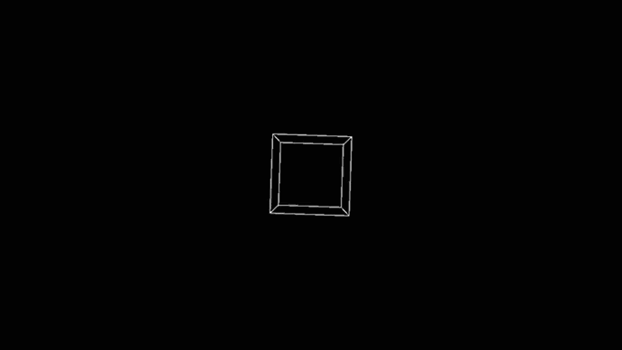

<h1>Transformation: Rotation</h1>

# Rotation in computer graphics

Rotating objects is a basic transformation to alter an objects appearance and as such very common in applications that work with visual outputs.

The rotation commands in various software/frameworks provide us with a (rather) intuitive way of rotating objects, without necessarily having to dive into the mathematics of it.

---
# (a little bit of) the mathematics

Just like [translating](./translate.md), *rotating* something means converting (or transforming) it's coordinate space into another one. For an object, this works by multiplying the objects current transformation matrix with a rotation matrix.

> ANNOTATION: I think I got something mixed up here, sorry folks.
> If I understood Angela's [video lecture](https://owncloud.gwdg.de/index.php/s/zwUNl0K7QPoPBPU) correctly, the object's new rotation is calculated by using the following initial parameters: the angle amount you want to rotate and the axis you want to rotate around. So we have to calculate a VECTOR and a MATRIX and not 2 matrices.
> Depending on what axis we want to rotate around, the calculations are different (see ~ 36:10 in the video lecture for the different calculations). 

Every object in a scene has a transformation matrix in which it's translation, rotation and scaling are stored. Usually, the contents of this matrix can be accessed and edited directly by the user or scripts.

> ANNOTATION: Sorry, I don't think the storage matrix is itself a transformation matrix. However, this is probably just nomenclature for us and shouldn't be relevant to our applications.

As an example for 3D objects, this is the "Transform" Component of a GameObject in Unity:


And here we have the transformation matrix for a 3D model in AutoDesk Maya:


"Rotating" the object in a mathematical sense means multiplying the transformation matrix with a rotation matrix, which yields us a new transformation matrix for the object. This also implies that rotation, just like translation, is cumulative because we get a new matrix to start our next operation with.

> ANNOTATION: As mentioned above, this might be inaccurate.
> However, rotations are still cumulative, because in the end we still get a new transformation matrix, that we can then use for our next transformations.

Doing matrix multiplication requires a lot of math but can be useful in some cases. If you're interested in understanding the details of matrix multiplication and doing some proofs [this blog](https://www.javatpoint.com/computer-graphics-rotation) might be interesting to you.

> ANNOTATION: Even though I have mixed up some stuff, the math behind rotations is still complicated (at least to me), but Angela provided us with a cool video on how the math works. Please watch the [video](https://owncloud.gwdg.de/index.php/s/zwUNl0K7QPoPBPU)! :)

...

Luckily, Processing comes with functions that handle the matrix multiplication part and provide us with a rather intuitive ways of rotating objects. For (simple) 2D object rotation Processing has `rotate()`. In a 3D sketch we should use `rotateX()`, `rotateY()` and `rotateZ()` - these require the P3D renderer specified in the `size()` function.

---
# Using rotate() in Processing

From the Processing [reference](https://processing.org/reference/rotate_.html):

> `rotate()` Rotates a shape the amount specified by the angle parameter. Angles should be specified in radians (values from 0 to TWO_PI) or converted to radians with the radians() function.
> 
> Objects are always rotated around their relative position to the origin and positive numbers rotate objects in a clockwise direction.
> Transformations apply to everything that happens after and subsequent calls to the function accumulates the effect.
> 
> For example, calling rotate(HALF_PI) and then rotate(HALF_PI) is the same as rotate(PI). All transformations are reset when draw() begins again.
> Technically, rotate() multiplies the current transformation matrix by a rotation matrix. This function can be further controlled by the pushMatrix() and popMatrix().

Let's look at the different parts of this description in detail.

.

> `rotate()` rotates a shape the amount specified by the angle parameter. Angles should be specified in radians (values from 0 to TWO_PI) or converted to radians with the radians() function.

So instead of having to feed the function the whole matrix, we can just give it one parameter which is the angle of how much we want to rotate the object. But what is a radiant again?

A radiant is a standard angular measurement in mathematics. One of the advantages of working with radians is that the underlying mathematics are just less "messy" when using radians instead of angles in degrees (if you want to read more into it check out [Euler's formula](https://en.wikipedia.org/wiki/Euler%27s_formula#Applications_in_complex_number_theory)).

This gif illustrates the concept of a radiant:


You can also convert "normal" angles (circle = 360°) into radians using the `radians()` [function](https://processing.org/reference/radians_.html).

.

> Objects are always rotated around their relative position to the origin and positive numbers rotate objects in a clockwise direction.

For the rotation calculation to work properly we need to specify a rotation point, also known as *pivot* point.
The `rotate()` function takes the current transformation matrix as a pivot point by default. This will be reset every frame:

```java
void setup() {
  size(600, 500, P3D);
  noFill();
  stroke(255);
  frameRate(60);
}
void draw() {
  background(0);
  
  translate(width/2, height/2);
  rotate(PI / 3);
  box( 100, 100, 100);
}
```


If we multiply the angle value in `rotate()` with the [frameCount](https://processing.org/reference/frameCount.html), we can achieve a continuous rotation:
```java
void setup() {
  size(600, 500, P3D);
  noFill();
  stroke(255);
  frameRate(60);
}
void draw() {
  background(0);
  
  translate(width/2, height/2);
  rotate((PI / 180) * frameCount);
  box( 100, 100, 100);
}
```




We can also specfiy any other point as a pivot point around by stacking matrices, for example other objects:

```java
void setup() {
  size(600, 500, P3D);
  noFill();
  stroke(255);
  frameRate(60);
}
void draw() {
  background(0);
  
  translate(width/2, height/2);
  rotate((PI / 180) * frameCount);
  box(25);
  
  translate(100, 0);
  rotate((PI / 180) * frameCount);
  box(50);
  
  translate(100, 0);
  rotate((PI / 180) * frameCount);
  box(100);  
}
```


If we do not want to have the behaviour shown above, then we have to tell Processing that not all matrices should be calculated with each other. 
For this we can use the matrix stack with the commands `pushMatrix()` and `popMatrix()`:

```java
void setup() {
  size(600, 500, P3D);
  noFill();
  stroke(255);
  frameRate(60);
}
void draw() {
  background(0);
  
  // CUBE X
  pushMatrix();
  translate(width/4, height/2, 0);
  rotateX(frameCount * PI/180);
  box(50);
  popMatrix();
  
  // CUBE Y
  pushMatrix();
  translate(width/2, height/2, 0);
  rotateY(frameCount * PI/180);
  box(50);
  popMatrix();
  
  // CUBE Z
  pushMatrix();
  translate((width/4) * 3 , height/2, 0);
  rotateZ(frameCount * PI/180);
  box(50);
  popMatrix();
}
```


In this example I have used `rotateX()`, `rotateY()` and `rotateZ()`, which rotate the object *around* the axis in their name.

---

> ANNOTATION:

# Sources:

for the mathematical stuff:

- Harold Serrano [Rotations in Computer Graphics](https://www.haroldserrano.com/blog/rotations-in-computer-graphics);

- java T point on [Rotation](https://www.javatpoint.com/computer-graphics-rotation)

- Wikipedia entry on [Radians](https://en.wikipedia.org/wiki/Radian) - also the source for [Radians GIF](https://commons.wikimedia.org/wiki/File:Circle_radians.gif)! 

For the ANNOTATIONS:

- Angela's [video lecture](https://owncloud.gwdg.de/index.php/s/zwUNl0K7QPoPBPU)

and, of course, the Processing reference for
[rotate()](https://processing.org/reference/rotate_.html), and it's links to `popMatrix()`, `pushMatrix()`, `rotateX()`, `rotateY()`, `rotateZ()`, `scale()`, `radians()`
