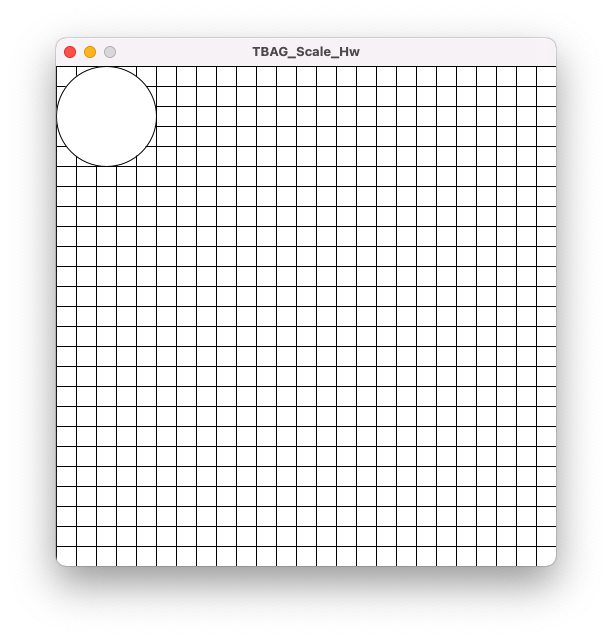
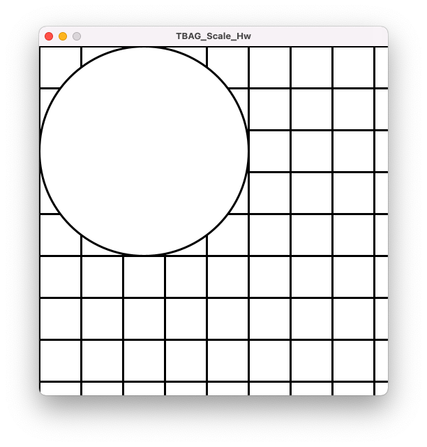
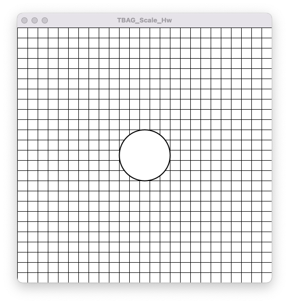

# Scale

The `scale()` transformation is used to increase / reduce the size of graphics. Just like the other transform functions `rotate()`and `translate()`, `scale()` is also altering the dimensions of the coordinate system rather than the graphics themselves. 
This can be exemplified by:
1. Defining a coordinate grid system to represent visually the coordinate system of x, y pixel positions
2. Drawing an ellipse infront of the grid
3. Placing `scale()`on the first line of `draw()`

First drawing the grid system and ellipse:

```js
int grid = 20;

void setup(){
  size(500, 500);
  background(255);
  smooth();
  noLoop();
}

void draw(){
  for (var x = 0; x < width; x += grid){
    for (var y = 0; y < height; y += grid){
      line(x, y, x, y + grid);
      line(x, y, x + grid, y);
    }
  }

  ellipse(50, 50, 100, 100);
}
```



Then adding `scale()`. 

```js
int grid = 20;

void setup(){
  size(500, 500);
  background(255);
  smooth();
  noLoop();
}

void draw(){
  scale(3, 3);
  for (var x = 0; x < width; x += grid){
    for (var y = 0; y < height; y += grid){
      line(x, y, x, y + grid);
      line(x, y, x + grid, y);
    }
  }

  ellipse(50, 50, 100, 100);
}
```



With this we can see that scale is working **on the udnerlying coordinate system of Processing** because the ellipse, the grid **and the grid's line thickness** have all been increased in size proportionately (in this case by 300% on the x axis and 300% on the y axis).

# Keeping Objects in the Desired Position

Because `scale()` increases / decreases from the origin of 0, 0 (as apposed to outwards / inwards from the middle of the window for example), we also need to offsett the position of the shape, relative to the scale amount. This can be done by using `translate()` (see [translate.md](translate.md)).

For example:
```js
int grid = 20;

void setup(){
  size(500, 500);
  background(255);
  smooth();
  noLoop();
}

void draw(){
  for (var x = 0; x < width; x += grid){
    for (var y = 0; y < height; y += grid){
      line(x, y, x, y + grid);
      line(x, y, x + grid, y);
    }
  }
  
  translate(width/2, width/2); // Move origin of shaope to the middle
  scale(2); // scale by 200% on x and y axis
  ellipse(0, 0, 50, 50);
}
```
This code results in this:


You may ask yourself, "but what if I scale by 3 (300%)? How will I know how much to translate the ellipse so that it is back in the center?"

One way is to whip out the calculator and figure out by how many pixels the `shape()`function has actually displaced the object.
If we were to take the above values (where the ellipse is being drawn at 250, 250), but scale by 3:
1. 250 * 3 = 750
2. 750 - 250 = 500 (the difference between origin and displacement)
3. `translate(-500, -500)`
   
I'm sure there's a code based way to do this automatically, but it's outside the scope of my brain right now...

> Handy tip: Just like the other transform functions, calculations are **cumulative**, meaning that scale(2.0) followed by scale(1.5) is the same as a singular instance of scale(3.0). 


# pushMatrix() & popMatrix()
The above example works fine to draw this singular shape. 
However, if we were to go on to draw subsequent shapes, they would all be drawn relative to the offset coordinate system following the rules of:
- `translate(width/-2, width/-2);` and
- `scale(2);`

To ensure that this doesn't happen, we use the push/popMatrix() function. 
What this does is to execute all code betwee `pushMatrix()` and `popMatrix()`. After the code in between is executed, the coordinate system gets reset to the it's state *prior* to `pushMatrix()`. 
This then allows us to program coordinates and other transoformation functions according to the coordinate system in it's default position.

This can be easily shown through animation. 

# Animation of Scale

To animate, we need some extra variables:
- A maximum scale size
- A minimum scale size
- An initial scale value
- An amount to scale by incrimentally

These are defined at the start of the sketch:
```js
int grid = 20;
float scaleMax = 7;
float scaleMin = 1.5;
float scaleVal = 2;
float scaleIncrement = 0.1;
```

We will also use an ` if - or ` statement to control the growing/shrinking of the shape. 
```js
  if (scaleVal >= scaleMax || scaleVal <= scaleMin) {
    scaleIncrement = scaleIncrement * -1;
  }
  ```
> Remember that two "pipes" ( || ) means "or" and the ( ... * -1) mathematics *inverts* a value, effectively reversing the movement direction in our case. 

We then use a rectangle in the middle instead of an ellipse, so that we can learn the handy function argument (center) and place an ellipse somewhere else in the window. 

Then our sketch looks like this:

```js
int grid = 20;
float scaleMax = 7;
float scaleMin = 1.5;
float scaleVal = 2;
float scaleIncrement = 0.1;

void setup() {
  size(500, 500);
  background(255);
  smooth();
  // noLoop();
}

void draw() {
  scaleVal += scaleIncrement;
  background(255);

  for (var x = 0; x < width; x += grid) {
    for (var y = 0; y < height; y += grid) {
      line(x, y, x, y + grid);
      line(x, y, x + grid, y);
    }
  }
  


  pushMatrix();
  fill(255);
  translate(width/2, height/2);
  scale(scaleVal);
  rectMode(CENTER); // this sets the origin of the rect to the middle of the shape, meaning the last two arguments become width and height. This allows the rect to grow and shrink from the middle, which is how we typically expect something to "grow" in size.
  rect(0, 0, 50, 50);
  popMatrix();

  fill(0);
  ellipse(100, 100, 100, 100);


  if (scaleVal >= scaleMax || scaleVal <= scaleMin) {
    scaleIncrement = scaleIncrement * -1;
  }
}
```
If you run this code, the rectangle will stay in the middle, growing and shrinking in size, while the ellipse will also stay in place. 
If you comment out the `pushMatrix() and pullMatrix()` lines, you will see that the ellipse also starts to grow, but also to move!

This is because the coordinate system on which the ellipse is being drawn relative to, is being "shifted" and scaled acording to `translate()` and also `scale()`. 