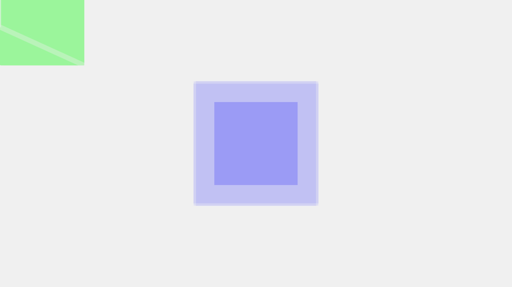
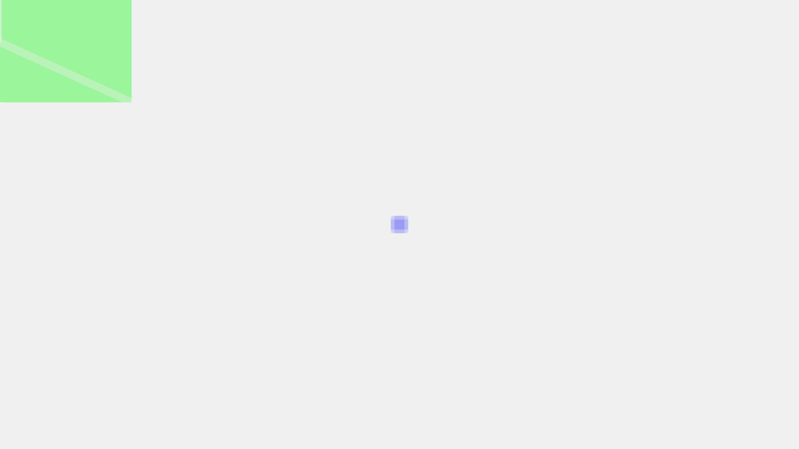
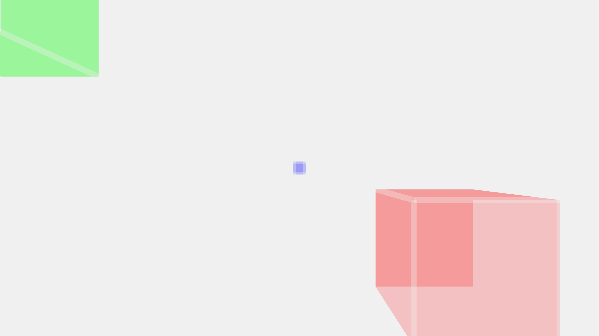
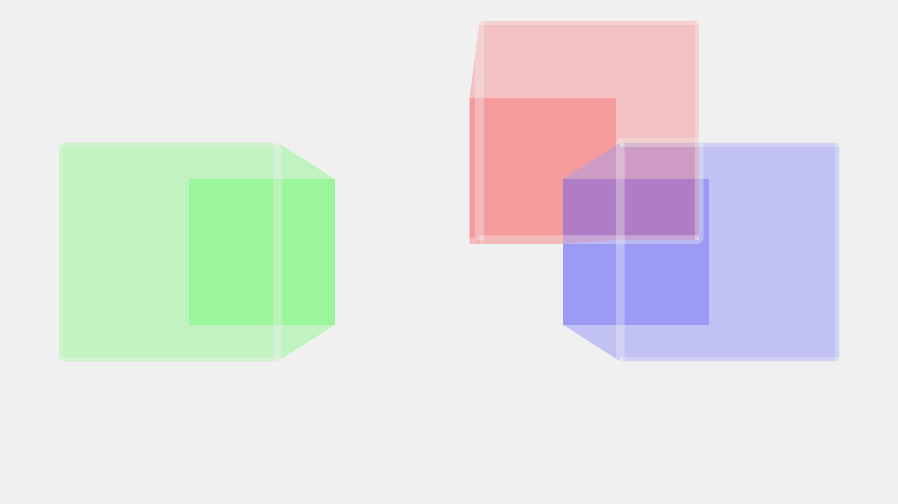
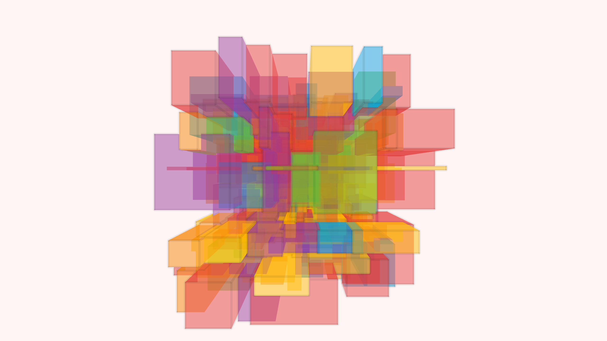
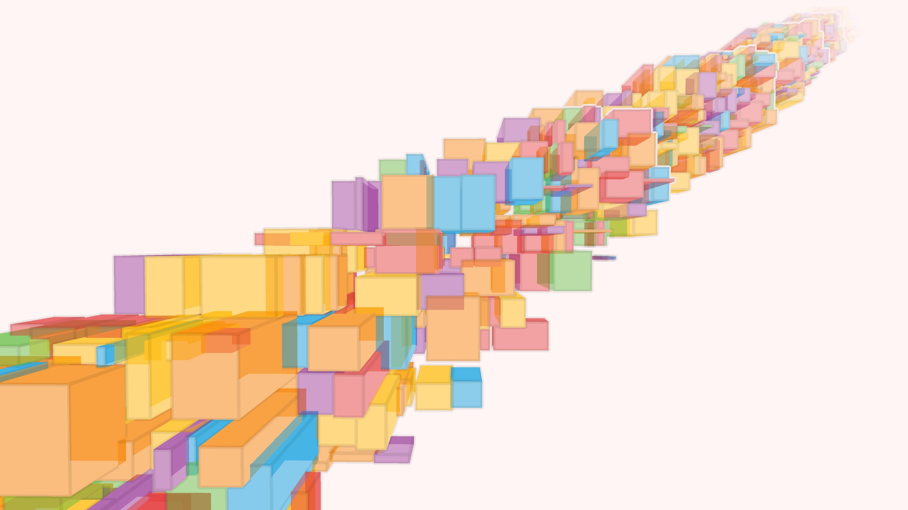

<h1>translate() and related functions</h1>
<h2>translate()</h2>

Translate() moves the origin of coordinate system around, which creates the handy illusion that the objects on display have changed their position:

```java
void setup()
{
  fullScreen(P3D);
  stroke(240, 240, 240, 50);
  strokeWeight(25);
}

void draw()
{
  background(240, 240, 240);

  //draws green box
  fill(0, 255, 0, 50);
  box(500);
  
  //draws blue box
  translate(width/2, height/2);
  fill(0, 0, 255, 50);
  box(500);
}
```


The blue box wasn't drawn in the origin like the green box, despite the exact same box() function being used. This is very useful since the box() function doesn't provide any positioning parameters of its own.

<h3>Syntax</h3>
translate(x, y)

translate(x, y, z)

<h3>Parameters</h3>
x	(float)	left/right translation

y	(float)	up/down translation  
z	(float)	forward/backward translation

As you probably noticed, you can also translate() using the z-axis:

```java
void setup()
{
  fullScreen(P3D);
  stroke(240, 240, 240, 50);
  strokeWeight(25);
}

void draw()
{
  background(240, 240, 240);

  //draws green box
  fill(0, 255, 0, 50);
  box(500);
  
  //draws blue box
  translate(width/2, height/2, -10000);
  fill(0, 0, 255, 50);
  box(500);
}
```


Translations(and transformations in general I guess) are cumulative, which means that they add up to each other.
The blue box is the "new origin" for the second translation in this example:

```java
void setup()
{
  fullScreen(P3D);
  stroke(240, 240, 240, 50);
  strokeWeight(25);
}

void draw()
{
  background(240, 240, 240);

  //draws green box
  fill(0, 255, 0, 50);
  box(500);
  
  //draws blue box
  translate(width/2, height/2, -10000);
  fill(0, 0, 255, 50);
  box(500);

   //draws red box
  translate(width/4, height/4, 10000);
  fill(255, 0, 0, 50);
  box(500);
}
```

Translations do however not carry over for each call of the draw() loop, otherwise there'd be nothing to see in these examples. 

<h2>pushMatrix() & popMatrix()</h2>
To avoid this cumulative behaviour and to apply unrelated translations to each object, you can create a stack of matrix transformations. You can push into and pop out of this stack just like with a regular array using pushMatrix() and popMatrix(). Only the red box follows the mouse position in this example:

```java
void setup()
{
  fullScreen(P3D);
  stroke(240, 240, 240, 50);
  strokeWeight(25);
}

void draw()
{
  background(240, 240, 240);

   //draws green box
  pushMatrix();
  fill(0, 255, 0, 50);
  translate(width/4, height/2);
  box(500);
  popMatrix();
  
  //draws blue box
  pushMatrix();
  fill(0, 0, 255, 50);
  translate(width-width/4, height-height/2);
  box(500);
  popMatrix();
  
  //draws red box
  pushMatrix();
  fill(255, 0, 0, 50);
  translate(mouseX,mouseY);
  box(500);
  popMatrix();
}
```


You can use this method to create regular (or not so regular) patterns using our old sturdy 10PRINT approach:

```java
for (float x = startingPoint, x < xMax, x += xIncrease)
{
    for (float y ...)
    {
        translate(x, y);
        box(500);
    }
}
```



I added another for loop for the z-axis for(lel) the previous image. You get a better look of what's happening here:

 

 This got quite funky in a short time! Remember though that boxes always get drawn from their center. 
 You can also animate your boxes using translate(), but I didn't figure out how to use arrays and objects in Java without getting severly irritated. 

 <h2>Sources</h2>

 [translate()](https://processing.org/reference/translate_.html)

 [popMatrix()](https://processing.org/reference/popMatrix_.html)


