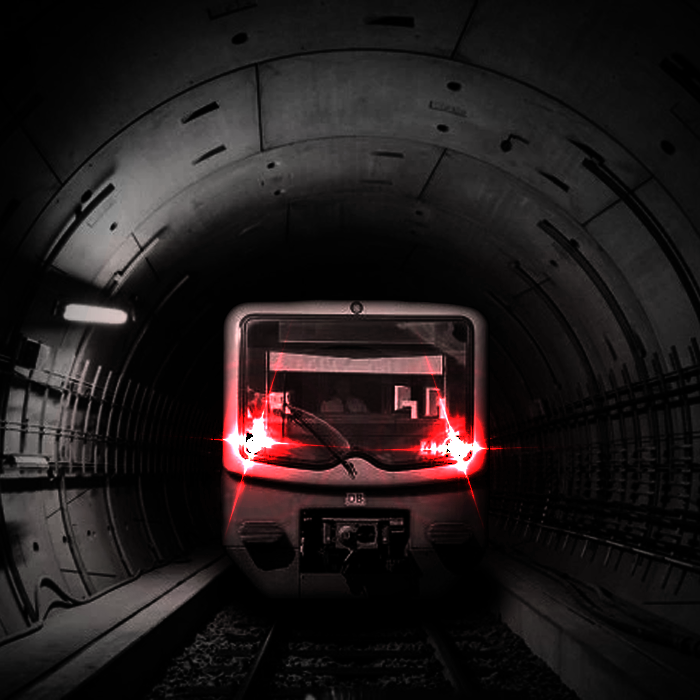

# S2 Nach Bernau

My audio project tries to capture the feeling of taking the S2 at Yorckstr. all the way to the last station Bernau. It's a (train) track which changes between the above, the dark underground, the busy huge station (Gesundbrunnen) and then the calm outskirts of Berlin.

I only used sounds I recorded while on the train and manipulated them.

With the use of Helm I could also implement to Synthesizers I created myself.

I did the project in FL Studio. For accessibility I also uploladed my distorted and modulated samples as well as the originals.