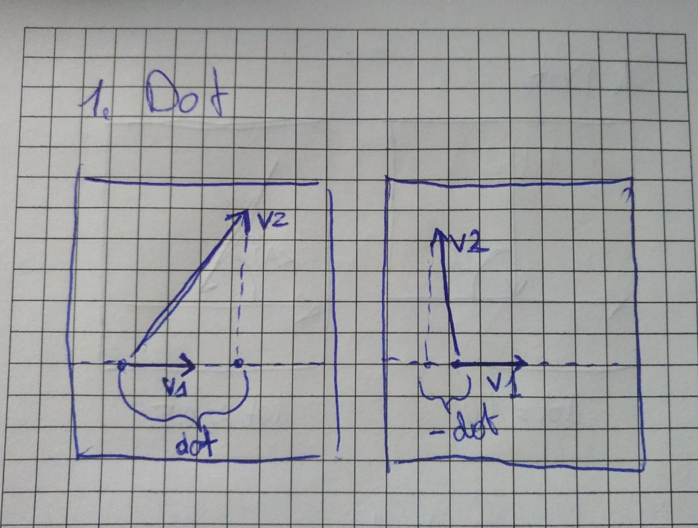
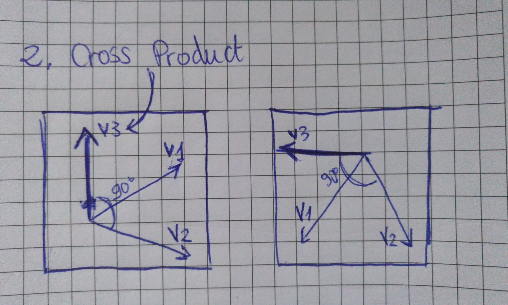
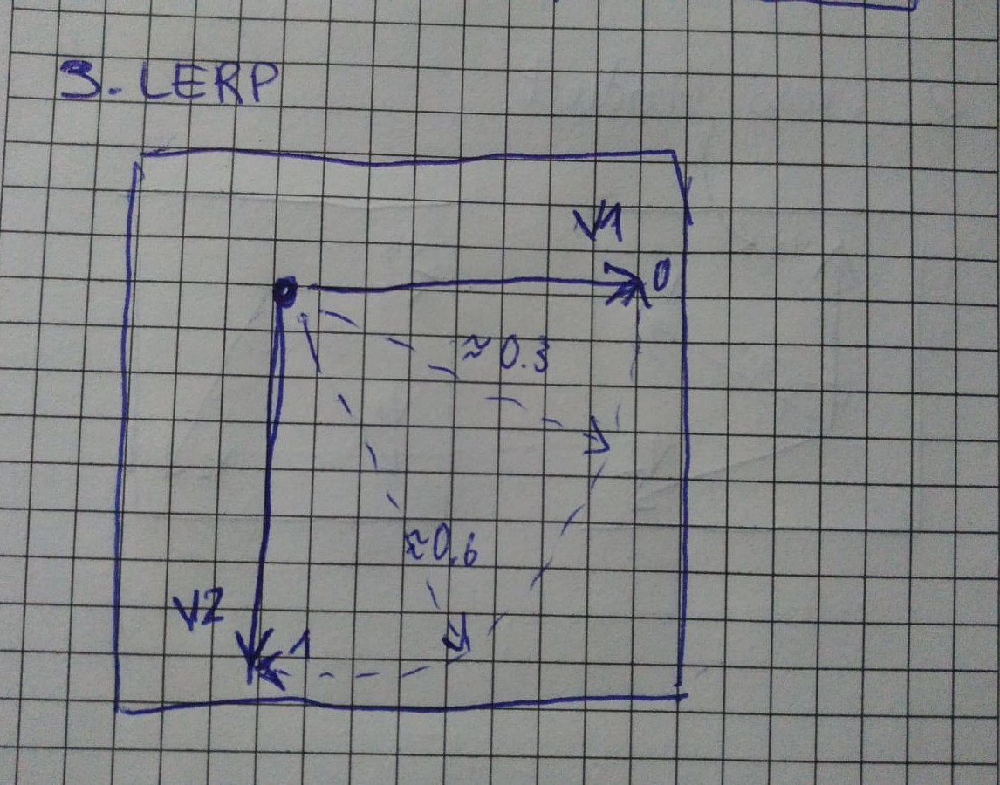

# Exercise 2

What happens during each of them?
Checkout the following functions:

## 1. Dot Product
https://p5js.org/reference/#/p5.Vector/dot

Dot Product takes two vectors (v1 and v2) where v1 is a unit vector pointing in a theoretically "endless" direction
and returns a scalar value that is the length of v2 projected on v1. 
The dot product can be negative aswell pointing in a different direction then the direction of v1.

## 2. Cross Product
https://p5js.org/reference/#/p5.Vector/cross

The cross product between two vectors (v1 and v2) returns a v3 that is orthagonal to the plane 
of which v1 and v2 are part of. It represents the "normal" of that plane.
This is used to calculate light or physics.

## 3. LERP
https://p5js.org/reference/#/p5.Vector/lerp

Lerp is a linear interpolation between two values or vectors.
It takes a third amount argument, that is usually between 1 for one end of the range and 0 for the other side of the range. Based on the value that this amounts takes a "mix" of the two specified values get calculated
by applying the ratio of the amount.

