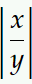
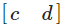

# CTech | TBAG - Vectors & Matrix Worksheet

## Vectors
	
 ###  What is a column vector vs a row vector
 - Column vectors are n*1 (height * width) matrices. E.g. 
 - Row vectors are 1*n (height * width) matrices. E.g. 

 ### How do you calculate the dot or inner product?
 - The dot product is the result of the mathematical operation, where you add together the multiplications of the corresponding indexed values. The dit product of the above shown vectors would be **x*c + y*d**. 

 ### What does it tell you if the dot product is 0, <0 or >0?
 - If the DP is 0, the two vectors are pointing exactly in the opposite direction (the angle between them is 180 degrees)
 - if the DP is <0, the two vectors are not pointing in the same direction (the angle between them is >90 / <270).
 - if the DP is >0, the vectors are pointing in the same direction (the angle between is <90 / >270).

 ### What is a normalized vector and how do you calculate it?
 - A normalized vector "u*" is the version of any vector "u" with a magnitude of 1. To calculate a normalized vector, we just have to divide every element of its matrix by the magnitude. 

 ### What is a normal vector
- The normal vector of a surface is a vector that is perpendicular to the object (in both directions). For example the normal vector of the plane created by the Y and Z axis would be the X axis. 

## Matrices
### What is a matrix generally speaking and what does it consist of?
- In mathematics, a matrix is a rectangular array of numbers, arranged in rows and columns used to represent an object and its properties.
### What does a matrix represent geometrically.
- In geometry, matrices are used to represent transformations like scale, rotate, shear...
### What is a transposed matrix
- The transpose matrix "At" is the version of matrix "A" that is flipped over its diagonal. This means that the transposed version of a 3*2 matrix would be 2*3. 
### How do you multiply two matrices?
- Two matrices can only be multiplied, if the number of columns of the first one equals the number of rows of the second one (e.g. an a * b (rows*columns) format matrix can only be multiplied by a b * n format matrix, and the result will be an a * n format matrix). If we multiply the matrices:
-       A = |a11 a12|   and B = |b11 b12|
            |a21 a22|           |b21 b22|
            
    the result would be:
-       AB = |(a11*b11 + a12*b21) (a11*b12 + a12*b22)|
            |(a21*b11 + a22*b21) (a21*b12 + a22*b22)|

### Why is order important when multiplying several matrices together?
- You tell me

## Transformations 1
### What matrix operations are involved?
- Translation on the X axis by 6 units
### Derive the transformation matrices.
-       TX = |1  0  6|
             |0  1  0|
             |0  0  1|

## Transformations 2
### What matrix operations are involved?
- Scaling by 0.5 and translation by 3.5x and 3y unit
### Derive the transformation matrices.
-       Scalar : 0,5
        TX = |1  0  3,5|
             |0  1  3  |
             |0  0  1  |

## Transformations 3
### What matrix operations are involved?
- Scaling by 0.25X and 0,5Y | Shearing 1 unit parallel to the Y axis | Translating 6,25X and 0,25Y.
### Derive the transformation matrices.
-       Scalar Matrix:  |0.25   0  |
                        |0      0.5|

        Shear Matrix:   |1      0  |
                        |1      1  |

        Translate Mat = |1   0   6,25|
                        |0   1   0,25|
                        |0   0   1   |

## Transformations 4 
### Is this an affine transformation? What kinds of transformation are involved and how have they been applied? Derive the transformation matrix. 
- Yes, it is an affine transformation
- The applied transformations are the following:
    - Scale on X axis by 1/2
    - Translate on X by 1/2
    - Shear on Y by 1 unit
    - Rotate by 30 degrees
- Matrices:
-       Scalar Matrix:  |0.5    0  |
                        |0      1  |

        Translate Mat = |1   0   0.5|
                        |0   1   0  |
                        |0   0   1  |

        Shear Matrix:   |1      0  |
                        |1      1  |

        Rotate Matrix:  |cos 30     -sin 30|
                        |sin 30      cos 30|