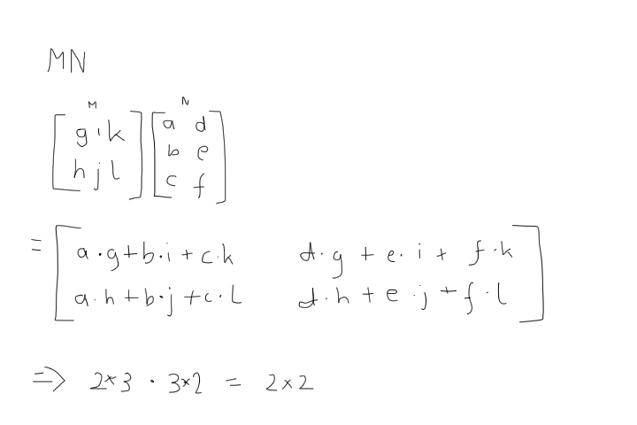
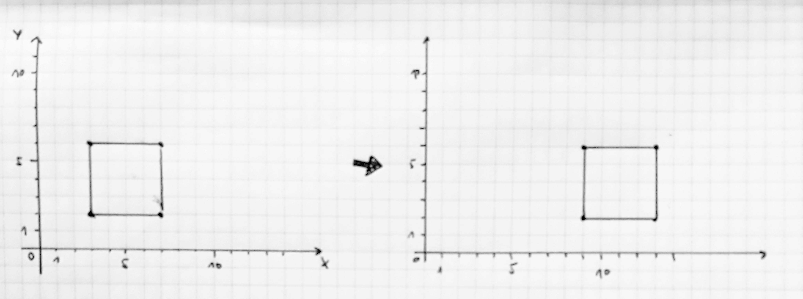
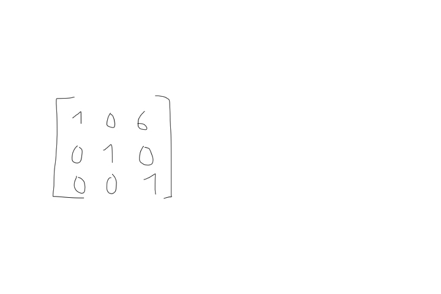
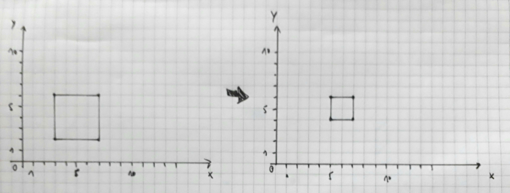
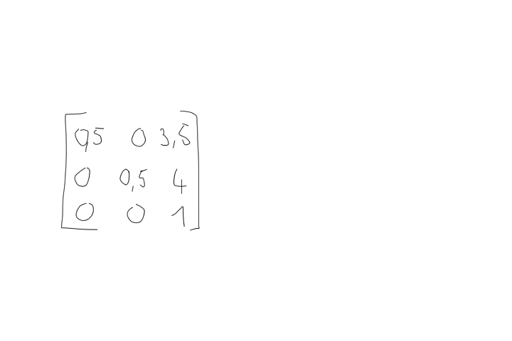
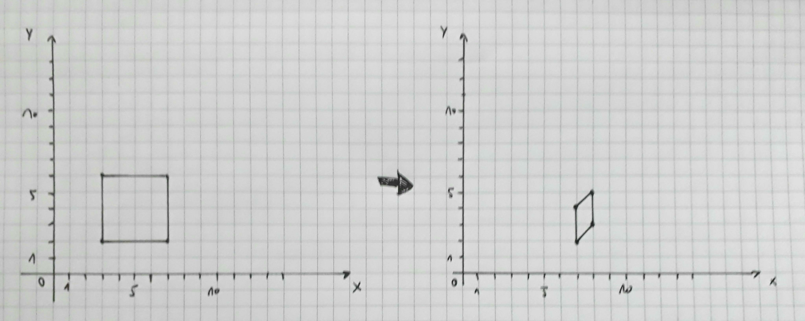
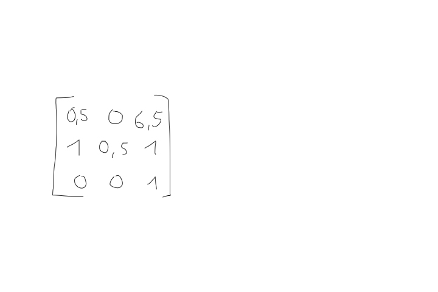
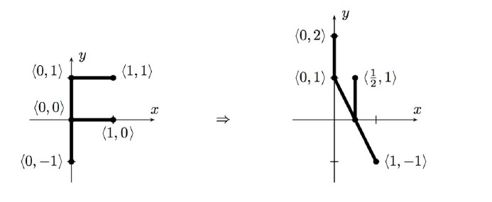
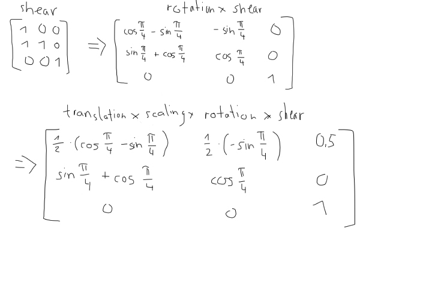

## Vectors

### What is a column vector vs a row vector?
column vectors generally can be understood as the defining basis vectors of the coordinate system, as long as the matrix is not transposed. In that case the row vetors would define the system and thus could be read as the basis vectors.

### How do you calculate the dot or inner product?
The dot product is calculated by multiplying the corresponding values (ax * bx etc.) and adding them together.

In a twodimensional system like this:

**a &sdot; b = ax * bx + ay * by**

or by multiplying the length of both vectors time the cosine of the angle between them.

like this: **a &sdot; b = |a| * |b| * cos($\alpha$)**

The result is a scalar value. That's why it's also called scalar product

### What does it tell you if the dot product is 0, < 0 or > 0?
When the dot product equals zero then the angle between the two vectors is 90°.
When the dot product is less than zero then the angle between the two vectors is bigger than 90°. When the dot product is more than zero then the angle between the two vectors is smaller than 90°.

### What is a normalized vector and how do you calculate it?
A normalized Vector has the length or magnitude 1. The length is calculated like this:

**|A| = sqrt(ax * ax + aY * aY + az * az)**

The normalization is calculated like this:

A / |A| = [ax/|A|,   aY/|A|,   az/|A|]

### What is a normal vector?
A normal vector is the vector that is perpendicular to the surface of a mesh at a given point.

---

## Matrices

### What is a matrix generally speaking and what does it consist of?
A matrix is basically an array of numbers with a certain dimension. In the use case of computer graphics for example it contains the scalar values of the basis vectors in one column. In a 2D environment the coordinate system is represented by two 2D vectors. The matrix is this a 2x2 Matrix (if not homogenous coordinates)

### What does a matrix represent geometrically?
The matrix represents all the transformations(linear transformation and (if homogenous coordinates) also the affine transformations (translation)).

### What is a transposed matrix?
In a transposed matrix columns and rows are flipped.

### How do you multiply two matrices?
Matricies are multiplied from right two left and by multiplying each column vector of the first with each row vector of the second matrix. Like this:

### Why is order important when multiplying several matrices?
When multiplying matrices the order of the transform matrixes matters since they are not commutative. You can change the order but it will have a different outcome for each order.

---

## Transformations
### Task 1

The quad is translated on the x-axis by 6. 

The resulting matrix with homogenous coordinates looks like this:

---
### Task 2

The quad is scaled by 0.5. And then translated on the x axis by 3.5 and by 4 on the y axis.

The resulting matrix with homogenous coordinates looks like this:

---
### Task 3

The quad is scaled by 0.5. And then sheared on the y axis by 1 and transalted on the x axis by 3.5 and by 4 on the y axis.

The resulting matrix with homogenous coordinates looks like this:

---
### Task 4

This is a mix of affine(translation) and linear transformations(rotation and shearing & scaling)
First it is sheared on the x axis (1,0 => 1,1). Then is rotated by 45 degrees. Then it is scaled on the x axis by 0.5 and then it is translated on the x axxis by 0.5.

The resulting matrix with homogenous coordinates looks like this:

**There is something wrong here, didn't figure out what**

---
