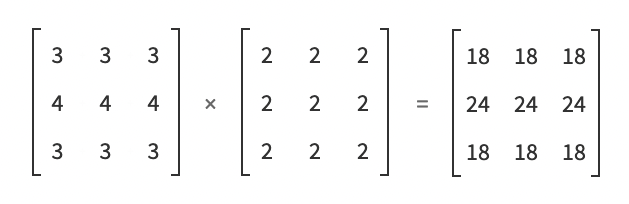
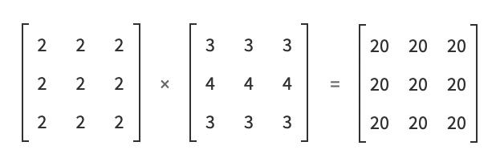

# Vector Matrix Sollutions - Schaeuble

## Vectors

1. What is a column vector vs a row vector?
A column vector is a coordinate system of x, y presented in a matrix *vertically*, while a row vector has it's coordinates presented *horizontally* within the matrix. 

2. How do you calculate the dot or inner product?

In the case of [x1 y1] and [x2 y2]
dot product = a • b = [x1 • x2] + [y1 • y2]

or [length of vector a] • [length vector b] x cos (of the angle where vector a and b meet).

3. What does it tell you if the dot product is 0, <0 or >0?
if DP = 0. The two vectors are perpendicular to oneanother / at a right angle. 
if DP = <0. Angle between the vectors is more than 90deg
if DP = >0. Angle between the vectors is less than 90deg

4. What is a normalised vector and how do you calculate it?
A normalised vector is a vector which has been recalculated as a unit vector. It always has a length of 1 as the vector is mutliplied by its magnitude. 
This vector maintains directional information of the vector.
Calculation: 1/||a||  

5. What is a normal vector?
A vector that is perpendicular to the surface at a given point.
ie, a cube has six possible directions for a normal vector.

## Matrices
1. What is a matrix generally speaking and what does it consist of?
A matrix is an array (collection) of values, that together provide data that is relevant for sucessive data processing. 
In our case, the matricies hold coordinate data which define points in space relative to a coordinate system. Graphics rendering programs use this data to perform geometric functions for visual representation. 

2. What does a matrix represent geometrically?
It represents one or more points within a coordinate system comprising of x, y and in the case of 3D, a z axis. 

3. What is a transposed matrix?
A matrix that has it's format switched from column vectors to row vectors. 
eg  
a c e  
b d f  

becomes

a b  
c d  
e f

4. How do you multiply two matricies?
Each matrix indicie gets multiplied with it's "partner" indicie. 
eg, using the above matrices again (where the horizontal matrix is the 1st matrix, and the vertical matrix is the 2nd):

| (a•a + c•c + e•e) (b•a + d•c + f•e) |  
| (a•b + c•d + e•f) (b•b + d•d + f•f) |

5. Why is order important when multiplying several matricies together?
This is because when multiplying matricies, we are multiplying the *rows of the second matrix* by the *columns of the first matrix*.
If we swap the orders of the matricies, then we are swapping which matrix contributes rows to the calculation, and which contributes columns. 
This will either give us the incorrect result, or won't work at all.
In the case of: matrix a = 3x2 and matrix b = 2x4
a•b will work. 
b•a will not work as we have a mismatch in the number of column values in A with the number of row values in B.
This is the same when dealing with two matricies with the same amount of rows and columns.  

  

## Transformations

1. 
- What matrix operations are involved?
Translation on the x axis by 6 units.

- Derive the transformation matrices  
1 - 0 - 6  
0 - 1 - 0  
0 - 0 - 1  

2. 
- What matrix operations are involved?
Scaling

- Derive the transformation matrices. 
scaled 50% and translated by 2 on the x axis (assuming origin is 3,6 as it would be in processing)

Scaling matrix  
0.5 - 0 - 0  
0 - 0.5 - 0  
0 - 0 - - 1  

Translation matrix  
1 - 0 - 2  
0 - 1 - 0  
0 - 0 - 1  

3. 
- What matrix operations are involved?
Had to ask colleagues about this one, to know it was called shearing. 
Translate -> scale -> shear

- Derive the transformation matrices. 

Translate  
1 - 0 - 4  
0 - 1 - 1  
0 - 0 - 1  

Scale  
0.25 - 0 --- 0  
1 ---- 0.5 - 0  
0 ---- 0 --- 0  

Shear  
1 - 1 - 0  
0 - 1 - 0  
0 - 0 - 1  

4. 
Yes, this is an affine transformation because lines and parallelism have been maintained, but distances between points and angles have been altered. 
Transformations involved: rotation 90deg -> shear y axis by 1 -> rotate by ?

Rotation  
Couldn't figure it out. Without looking at classmates sollutions.

Shear  
1 - 1 - 0  
0 - 1 - 0  
0 - 0 - 1  

Rotation  
Couldn't figure it out. Without looking at classmates sollutions.

