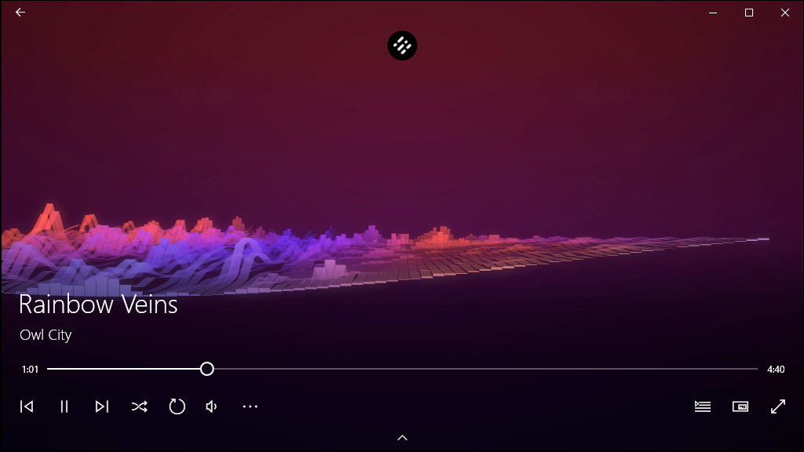

# Final Project Concept

---

For the final project, I would like to create a custom waveform visualizer that uses vertex shaders to deform the points in the waveform, with different waveforms for low-frequency, mids, and high-frequency audio content. If possible I’d like to create circular version, resembling the rings of a planet, but this may be a nice to have.

---

The technical tasks for this concept could be broken down as follows:

- split the audio frequency content into low, mids, highs
- generate an array of amplitude values for each sample - 44.1k or 48k per second of audio (this may be a huge array, so this may need to be sampled at a lower sample rate for performance)
- use the vertex shader to generate the waveform visuals
  - x-axis would represent positive time, higher values = further along in the song
  - generate a point for each sample, with the coordinates [*time*, 0, 0]
  - use the vertex shader to offset the y-values at each point by the amplitude of the sample at that point in time
