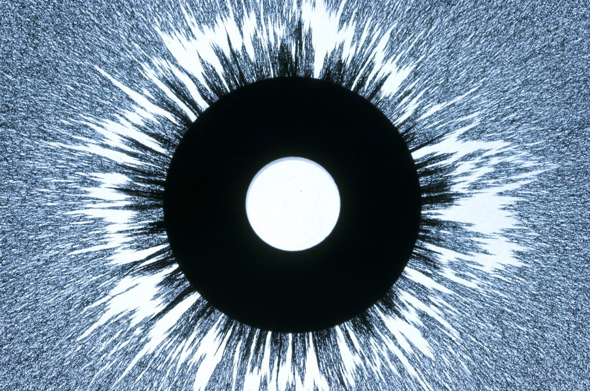
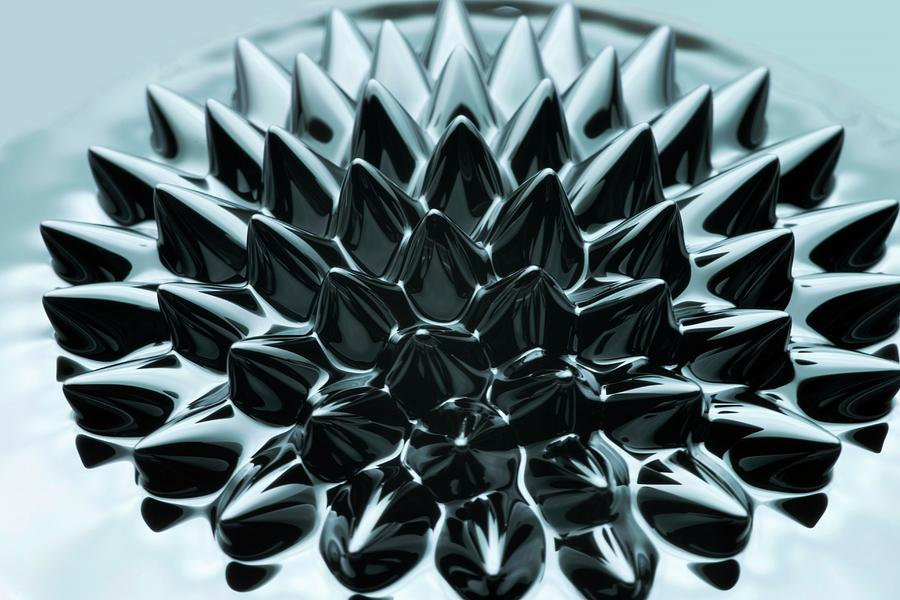
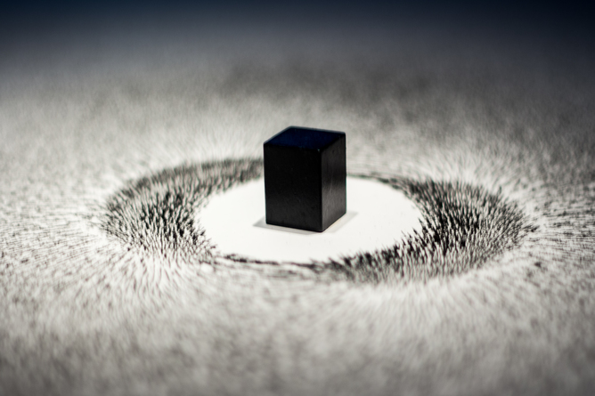
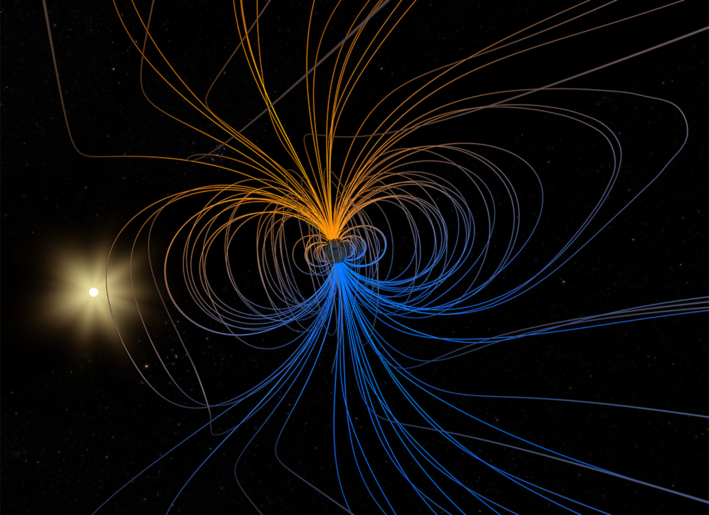

# Project Outline

---

### Visuals

For my final project I would like to draw inspiration from **magnetism**, at least when it comes to the visuals. I think there is a lot of different qualities that can be visualized based on that theme. There is attraction and repulsion, flow fields that can be visualized, states of floating and weightlessness but also heavyness and attachment.
For example slow morphing soft ferrofluid blobs are in contrast to flowing, spikey magnetic powder particles.
I think that way a lot of what happens in the music could be represented visually  .

### Audio

Regarding the audio part. I would like to keep it playfull in the process. I aim for a dark cinematic vibe with heavy drone like sounds and some noisey sparkly percussive elements.

### Technical approach

I'll try to do a lot with shader code. For the audio reactiveness I would like to do a mix of fft analysis and see if it is possible to also synch the playback with midi data from an exported midi file. That way I could emphasize specific elements better.

---