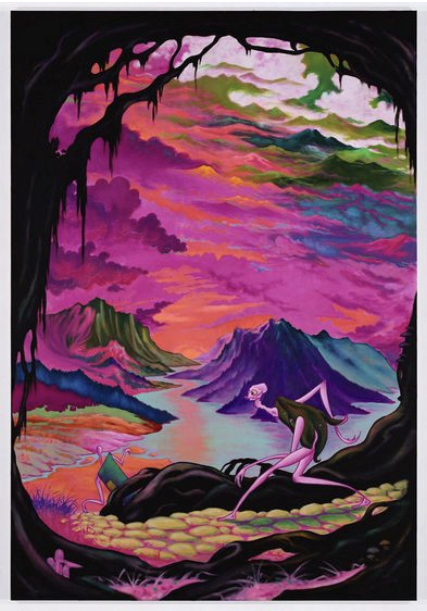

# TBAG Project Proposal
My idea is to create a moving, real time, abstract generative landscape that incorporates the triggering of bell samples dependant on variables stemming from the real time graphics generation used to build the environment.  
The inspiration follows a hallucination I had once when I was a young child - but has been reinvigorated by the [MacOS Monterey screensaver](https://www.youtube.com/watch?v=zRctVvta81I) as well as the paintings of Uwe Henneken, namely the work below titled "Tiptoe to Tripperary".

I very much like these aesthetics of abstract art, surrealism and endlessness and will try to achieve these themes in the project.

The motion of the MacOs screensaver is essentially exactly what I want in it's slow moving evolution, and I will more or less try to replicate this. 
Same as the mist. I also very much like the colour schemes of both Henneken's paiting and Apple's screensaver and will use them as a starting point for the colour scheme of my project.

In terms of how the sound will be integrated, I have these ideas:  
1. When a new cliff is genrated, trigger a random bell sample
2. When a cliff passes the near clipping plane, trigger a random bell sample
3. When a cliff passes into view past the far clipping plane, trigger a random bell sample
4. If the cliff is high in the camera view, map range of random bell sample selection to that of the higher timbres / vise-versa for mountains low in the camera view
5. Volume (amplitude) of bell sample playback dependant on how "far away" the newly generated bell is (measured in count n of generated mountains currently within the camera view / clipping planes)

I'm not yet sure whether I will use processing or Three.js for this project. But I'm leaning towards the idea that Three.js is a better option considering it's stronger in built functionality when working with 3D scenery. 