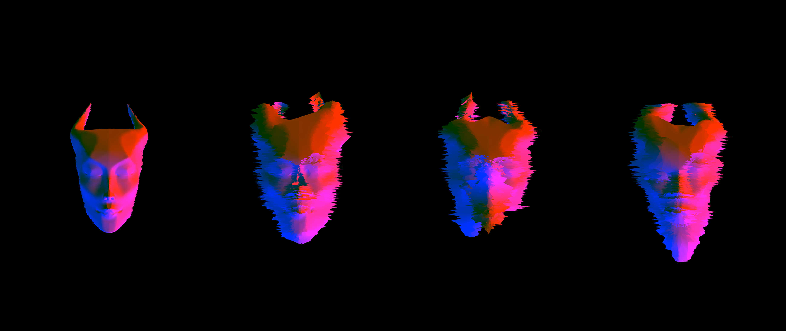

## Shader Exercises

For the shader exercises I stuck to modifying one sketch: the vertex displacement, as I found this one the most interesting.
The sketch is interactive:

- Press `Y` (= "yes") to make the head shake up and down.
- Press `N` (= "no") to make the head shake left to right.
- Press `C` (= "control") to make the head follow your mouse on the screen.
- `Click` the mouse button to make the shader go crazy!

The 3D model may be flipped upon start. Pressing any other button than the ones specified above will make face the right direction (and cancel any currently activate movement).

The shader gets progressively crazier over time, as it still has `frameCount` in it.
A little preview:



---

## Final Project Concept

```
Here I'll write about my project ....
```
