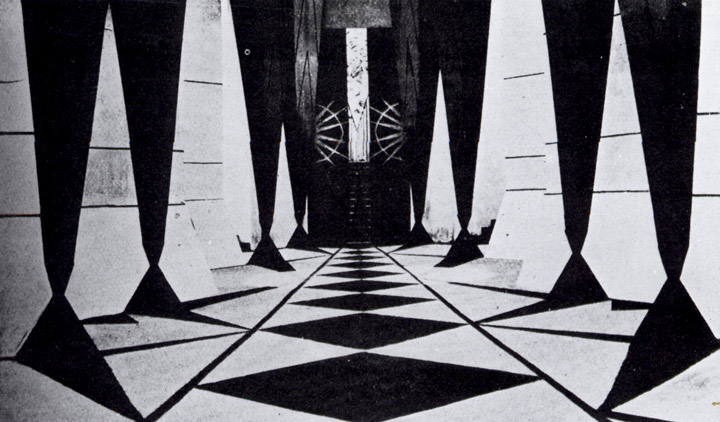
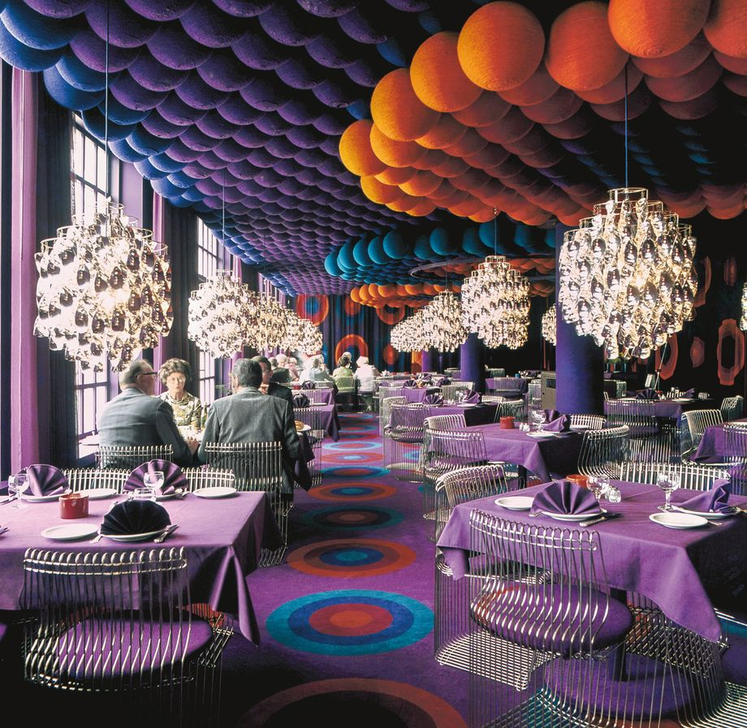

### Concept
Currently I have a "hallway" in form of an "array" of 12 groups/rows of objects.  
A group of these objects consists either of two elongated upside down pyramids, as well as a quad on the ground, or it consists of spherical grape-like shapes. I plan to render two scenes at once, one being pointier, grittier and black-and-white, while the other is friendly, fluffy and colorful. The former will use the pyramid and quad objects, while the latter will use the spherical grape-like shapes.  
Those two aesthetic worlds seem dichotomous, but I personally feel, that they can be combined in music. Indie Dance is a genre that heavily draws influence from gritty Cold Wave and Post Punk, as well as fluffy Italo Disco and combines it into one. My musical part of the project will therefore be an Indie Dance track.  

Gritty           |  Fluffy
:-------------------------:|:-------------------------:
 |  

Visually I plan to blend these two aesthetic worlds by the aforementioned rendering of two scenes at once. A perlin noise circle should function as a sort of "portal" between these two worlds, by extending and contracting from the vanishing point. Here I have a arrived at the connection of the visuals and the music.

### Connection

The radius of the perlin noise circle will be dictated by overall amplitude as well as RMS value of the track. Taking the RMS value into the equation will make the more fluffier "drop" more distiguishable to the grittier intro.  
Currently the sin functions that distort the space of my sketch are given arbitrary values. Instead I plan to link the frequency of the sin-functions to the bpm of the music. It's also no coincidence that I have selected 12 groups of objects. The amplitude of the sin-function will be multiplied with a variable for each row depending on amplitude in the 12 semitone frequency ranges. (However, I might go for the rows representing the frequency spectrum from low to high end, if the semitone approach will not look good.)  
Then finally, I want to represent timbre in some way by either causing the objects to jitter or introducing some vertex displacement.